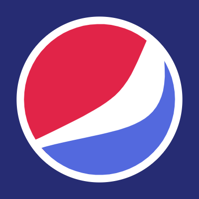
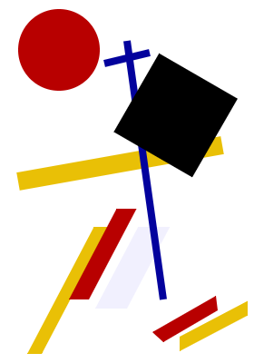
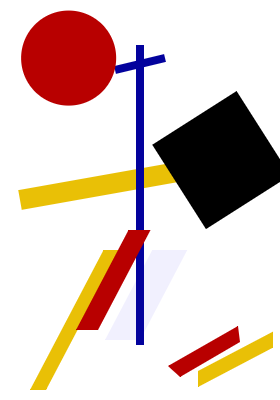

# **liveProject:** Creative Coding with p5.js
## Versionnumber 1.0.0 (2020-12-27)
(***Documentation last update 2020-12-27 18:30 CET***)  

Here the task for each chapter will listed and optional Notes / Information

## ChapterOne

### Tasks
_go to portal for the tasks, and more details_

### Notes
Inspiration taken from:  
-> https://www.behance.net/gallery/16259097/TRUEF-Mixed-Logos-Marks   
-> https://en.99designs.nl/blog/tips/types-of-logos/  

### Output

-> Knight/Cities/Challenge https://editor.p5js.org/akumagamo/sketches/iHLJuSjgS _(was pretty easy so I made are more challenging one)_     
   
-> Pepsi Logo https://editor.p5js.org/akumagamo/sketches/DrGMIXZHw _(has some nasty workaround to cleanup the  fill, but will be fixed, may be;-))_    
   

## ChapterTwo

### Tasks
_go to portal for the tasks, and more details_  

### Notes
Base First Example Image  

### Output

-> https://editor.p5js.org/akumagamo/sketches/nU9LfNeHY  

## ChapterThree

### Output

->  https://editor.p5js.org/akumagamo/sketches/kRJIKp4Dz 

[Short WebP Animation Video](submission_3.webp)
