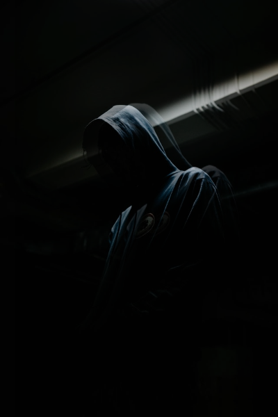
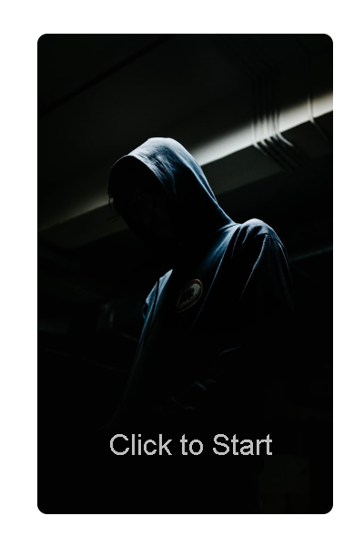
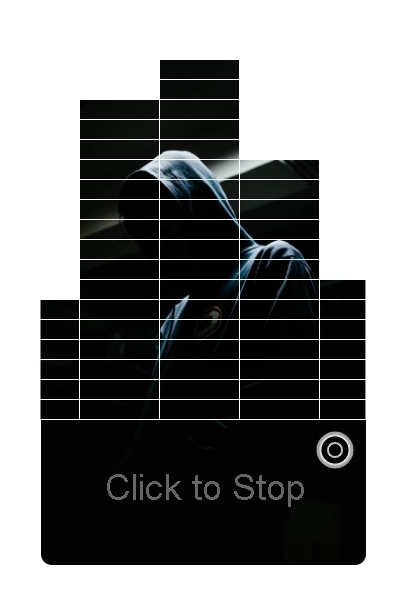

# **liveProject:** Creative Coding with p5.js
## Versionnumber 1.0.0 (2020-12-27)
(***Documentation last update 2020-12-27 18:30 CET***)  

Here the task for each chapter will listed and optional Notes / Information

## ChapterOne

### Tasks
_go to portal for the tasks, and more details_

### Notes
Inspiration taken from:  
-> https://www.behance.net/gallery/16259097/TRUEF-Mixed-Logos-Marks   
-> https://en.99designs.nl/blog/tips/types-of-logos/  

### Output

-> Knight/Cities/Challenge https://editor.p5js.org/akumagamo/sketches/iHLJuSjgS _(was pretty easy so I made are more challenging one)_     
   
-> Pepsi Logo https://editor.p5js.org/akumagamo/sketches/DrGMIXZHw _(has some nasty workaround to cleanup the  fill, but will be fixed, may be;-))_    
   

## ChapterTwo

### Tasks
_go to portal for the tasks, and more details_  

### Notes
Base First Example Image   

### Output

-> https://editor.p5js.org/akumagamo/sketches/nU9LfNeHY   

  

## ChapterThree

### Tasks
_go to portal for the tasks, and more details_    

### Output

->  https://editor.p5js.org/akumagamo/sketches/kRJIKp4Dz   

  

[Short WebM Animation Video](submission_3.webm)  

## ChapterFour

### Tasks
_go to portal for the tasks, and more details_   

### Notes

Base Image  

  

Photo by <a href="https://unsplash.com/@rendiansyah?utm_source=unsplash&amp;utm_medium=referral&amp;utm_content=creditCopyText">Rendiansyah</a> on <a href="https://unsplash.com/s/photos/dancer-in-the-dark?utm_source=unsplash&amp;utm_medium=referral&amp;utm_content=creditCopyText">Unsplash</a>

### Output

-> https://editor.p5js.org/akumagamo/sketches/zdUjQGf7-  

  

  

## ChapterFive

### Tasks
_go to portal for the tasks, and more details_   

### Notes

It is very basic, but I'm not very creative, I hope this will change.  

Base Song from https://www.unminus.com/, but shortend [link to shortend Song](Hospitalized - All Alone _ Dubstep _ 138 BPM _ wowa.me--AudioTrimmer.com--.mp3)  

### Output

-> https://editor.p5js.org/akumagamo/sketches/8zNyrRAUw  

  
  

[Short WebM Animation Video](submission_5.webm)   

